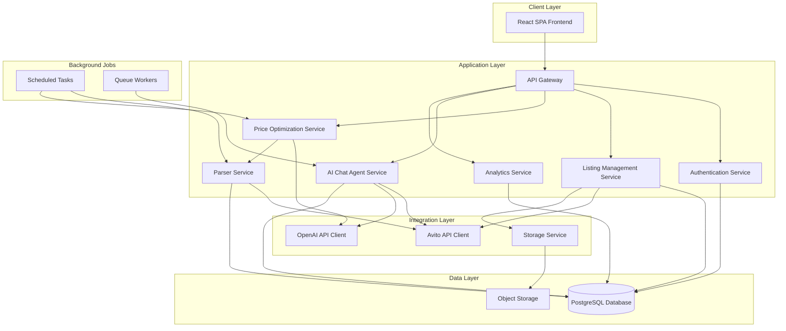
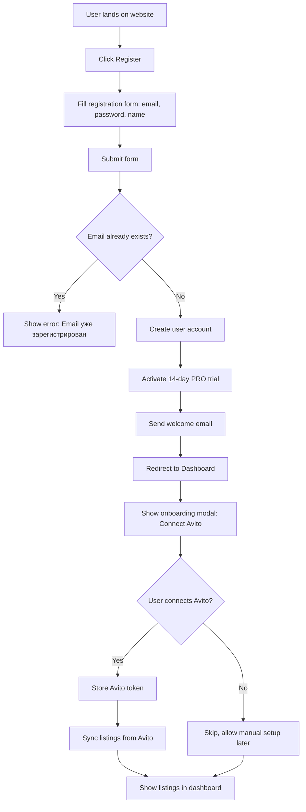
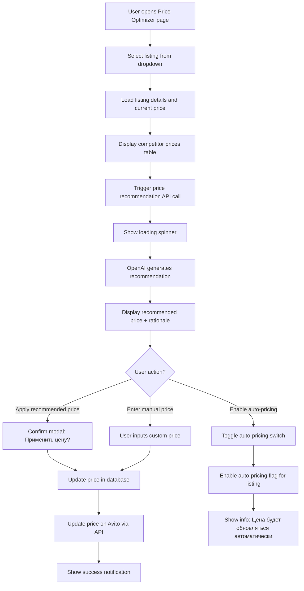
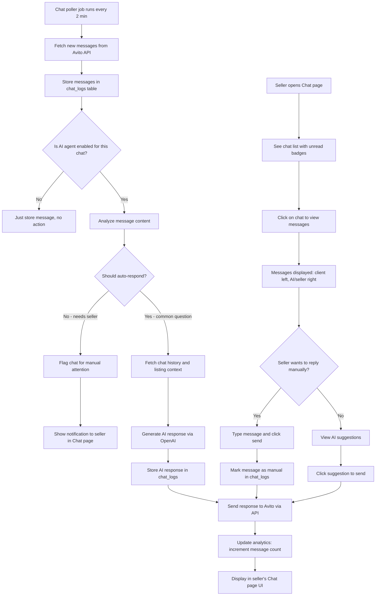
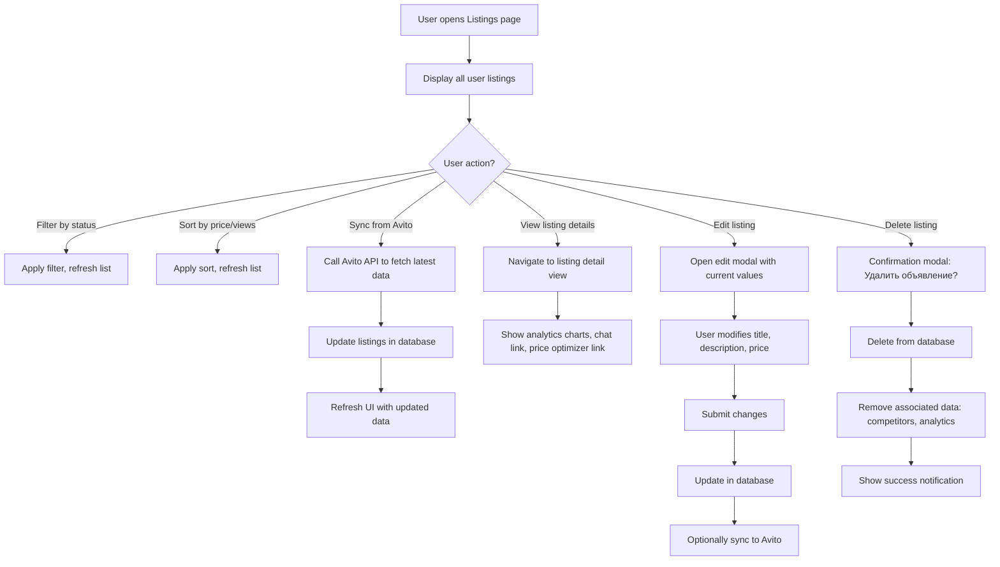

# Avvo - AI Helper for Avito: Technical Design Specification

## 1. Project Overview

### 1.1 Purpose
Avvo - AI Helper for Avito is an automation platform designed to streamline Avito sellers' workflow through intelligent price optimization and AI-powered sales assistance. The system aims to reduce manual effort, increase sales efficiency, and provide data-driven insights for Avito marketplace sellers.

### 1.2 Core Objectives
- Automate pricing decisions based on competitor analysis and market dynamics
- Provide AI-driven chat automation for customer interactions on Avito
- Deliver actionable analytics for listing performance optimization
- Ensure seamless integration with Avito API (Option A)
- Support full Russian language interface and communications

### 1.3 Key Success Metrics
- User engagement: Daily active listings managed
- Automation efficiency: Percentage of automated chat responses
- Price optimization impact: Average price adjustment accuracy
- User retention: Monthly active users by tariff tier

## 2. System Architecture

### 2.1 High-Level Architecture



### 2.2 Architectural Principles
- **Separation of Concerns**: Each service handles a distinct business capability
- **API-First Design**: All frontend interactions occur through well-defined REST APIs
- **Stateless Services**: Application services maintain no session state for scalability
- **Event-Driven Background Processing**: Long-running tasks execute asynchronously
- **Data Consistency**: Transaction boundaries ensure data integrity across related operations

## 3. Data Model Design

### 3.1 Core Entities

#### Users Table
| Field | Type | Constraints | Description |
|-------|------|-------------|-------------|
| id | UUID | PRIMARY KEY | Unique user identifier |
| email | VARCHAR(255) | UNIQUE, NOT NULL | User email for authentication |
| password_hash | VARCHAR(255) | NOT NULL | Hashed password |
| full_name | VARCHAR(255) | NULL | User display name |
| subscription_id | UUID | FOREIGN KEY | Reference to active subscription |
| avito_token | TEXT | NULL | Encrypted Avito API access token |
| registration_date | TIMESTAMP | NOT NULL | Account creation timestamp |
| last_login | TIMESTAMP | NULL | Last authentication timestamp |
| status | ENUM | NOT NULL | active, suspended, deleted |

#### Listings Table
| Field | Type | Constraints | Description |
|-------|------|-------------|-------------|
| id | UUID | PRIMARY KEY | Unique listing identifier |
| user_id | UUID | FOREIGN KEY, NOT NULL | Owner reference |
| avito_listing_id | VARCHAR(255) | UNIQUE, NOT NULL | External Avito ID |
| title | VARCHAR(500) | NOT NULL | Listing title in Russian |
| description | TEXT | NULL | Full listing description |
| current_price | DECIMAL(10,2) | NOT NULL | Active listing price |
| recommended_price | DECIMAL(10,2) | NULL | AI-suggested optimal price |
| category | VARCHAR(100) | NULL | Product category |
| status | ENUM | NOT NULL | active, paused, sold, archived |
| auto_pricing_enabled | BOOLEAN | DEFAULT FALSE | Price automation flag |
| created_at | TIMESTAMP | NOT NULL | Creation timestamp |
| updated_at | TIMESTAMP | NOT NULL | Last modification timestamp |

#### Competitors Table
| Field | Type | Constraints | Description |
|-------|------|-------------|-------------|
| id | UUID | PRIMARY KEY | Unique competitor entry ID |
| listing_id | UUID | FOREIGN KEY, NOT NULL | Reference to monitored listing |
| competitor_avito_id | VARCHAR(255) | NOT NULL | External competitor listing ID |
| competitor_price | DECIMAL(10,2) | NOT NULL | Observed competitor price |
| competitor_title | VARCHAR(500) | NULL | Competitor listing title |
| similarity_score | DECIMAL(4,2) | NULL | Match confidence (0.00-1.00) |
| scraped_at | TIMESTAMP | NOT NULL | Data collection timestamp |
| is_active | BOOLEAN | DEFAULT TRUE | Competitor listing status |

#### Analytics Table
| Field | Type | Constraints | Description |
|-------|------|-------------|-------------|
| id | UUID | PRIMARY KEY | Unique analytics record ID |
| listing_id | UUID | FOREIGN KEY, NOT NULL | Associated listing |
| date | DATE | NOT NULL, UNIQUE with listing_id | Analytics date |
| views_count | INTEGER | DEFAULT 0 | Listing view count |
| clicks_count | INTEGER | DEFAULT 0 | Contact button clicks |
| messages_count | INTEGER | DEFAULT 0 | Received message count |
| favorites_count | INTEGER | DEFAULT 0 | Times added to favorites |
| price_at_date | DECIMAL(10,2) | NULL | Price on this date |

#### Chat Logs Table
| Field | Type | Constraints | Description |
|-------|------|-------------|-------------|
| id | UUID | PRIMARY KEY | Unique message ID |
| listing_id | UUID | FOREIGN KEY, NOT NULL | Related listing |
| avito_chat_id | VARCHAR(255) | NOT NULL | Avito chat session ID |
| message_text | TEXT | NOT NULL | Message content in Russian |
| sender_type | ENUM | NOT NULL | client, ai_agent, seller |
| is_automated | BOOLEAN | DEFAULT FALSE | AI-generated flag |
| sent_at | TIMESTAMP | NOT NULL | Message timestamp |
| metadata | JSONB | NULL | Additional context data |

#### Subscriptions Table
| Field | Type | Constraints | Description |
|-------|------|-------------|-------------|
| id | UUID | PRIMARY KEY | Unique subscription ID |
| user_id | UUID | FOREIGN KEY, NOT NULL, UNIQUE | Subscriber reference (one active subscription per user) |
| plan | ENUM | NOT NULL | START, PRO, BUSINESS, ENTERPRISE |
| listing_limit | INTEGER | NOT NULL | Maximum allowed listings |
| ai_message_limit | INTEGER | NULL | Monthly AI message limit (null for unlimited) |
| start_date | DATE | NOT NULL | Subscription start |
| end_date | DATE | NULL | Subscription expiry (null for lifetime) |
| is_active | BOOLEAN | DEFAULT TRUE | Subscription status |
| auto_renew | BOOLEAN | DEFAULT FALSE | Auto-renewal flag |
| created_at | TIMESTAMP | NOT NULL | Subscription creation timestamp |
| updated_at | TIMESTAMP | NOT NULL | Last modification timestamp |

#### AI Message Usage Table
| Field | Type | Constraints | Description |
|-------|------|-------------|-------------|
| id | UUID | PRIMARY KEY | Unique usage record ID |
| user_id | UUID | FOREIGN KEY, NOT NULL | User reference |
| billing_month | DATE | NOT NULL | Billing period (YYYY-MM-01) |
| messages_used | INTEGER | DEFAULT 0 | AI messages sent this month |
| messages_limit | INTEGER | NOT NULL | Monthly limit for this period |
| last_reset_at | TIMESTAMP | NOT NULL | Last time counter was reset |
| updated_at | TIMESTAMP | NOT NULL | Last modification timestamp |

### 3.2 Data Relationships

```mermaid
erDiagram
    USERS ||--o{ LISTINGS : owns
    USERS ||--|| SUBSCRIPTIONS : has
    USERS ||--o{ AI_MESSAGE_USAGE : tracks
    LISTINGS ||--o{ COMPETITORS : monitors
    LISTINGS ||--o{ ANALYTICS : tracks
    LISTINGS ||--o{ CHAT_LOGS : receives
    
    USERS {
        uuid id PK
        string email UK
        string password_hash
        uuid subscription_id FK
        timestamp registration_date
    }
    
    LISTINGS {
        uuid id PK
        uuid user_id FK
        string avito_listing_id UK
        decimal current_price
        decimal recommended_price
        boolean auto_pricing_enabled
    }
    
    COMPETITORS {
        uuid id PK
        uuid listing_id FK
        string competitor_avito_id
        decimal competitor_price
        timestamp scraped_at
    }
    
    ANALYTICS {
        uuid id PK
        uuid listing_id FK
        date date
        integer views_count
        integer messages_count
    }
    
    CHAT_LOGS {
        uuid id PK
        uuid listing_id FK
        string message_text
        enum sender_type
        boolean is_automated
    }
    
    SUBSCRIPTIONS {
        uuid id PK
        uuid user_id FK UK
        enum plan
        integer listing_limit
        integer ai_message_limit
        date start_date
    }
    
    AI_MESSAGE_USAGE {
        uuid id PK
        uuid user_id FK
        date billing_month
        integer messages_used
        integer messages_limit
    }
```

### 3.3 Indexing Strategy
- **users**: Index on `email` (unique), `subscription_id`, `status`
- **listings**: Index on `user_id`, `avito_listing_id` (unique), `status`, composite index on `(user_id, status)`, composite index on `(user_id, auto_pricing_enabled)` for background jobs
- **competitors**: Index on `listing_id`, `scraped_at`, composite index on `(listing_id, is_active)`, index on `competitor_avito_id`
- **analytics**: Composite unique index on `(listing_id, date)`, index on `date` for time-based queries
- **chat_logs**: Index on `listing_id`, composite index on `(avito_chat_id, sent_at)`, index on `sent_at` for chronological queries
- **subscriptions**: Composite unique index on `(user_id, is_active)`, index on `end_date` for renewal processing
- **ai_message_usage**: Composite unique index on `(user_id, billing_month)`, index on `billing_month` for cleanup jobs

## 4. Frontend Architecture

### 4.1 Application Structure

```
/frontend
├─ /src
│  ├─ /components
│  │  ├─ /ui              # Base UI components (shadcn/ui)
│  │  ├─ /layout          # Layout components (Header, Sidebar, Footer)
│  │  ├─ /listings        # Listing cards, listing grid
│  │  ├─ /chat            # Chat interface, message bubbles
│  │  ├─ /analytics       # Charts, stat cards
│  │  └─ /pricing         # Price optimizer UI, competitor cards
│  ├─ /pages
│  │  ├─ Dashboard.jsx    # Main overview page
│  │  ├─ Listings.jsx     # Listing management
│  │  ├─ Chat.jsx         # AI chat interface
│  │  ├─ Analytics.jsx    # Analytics dashboard
│  │  ├─ PriceOptimizer.jsx  # Price optimization tool
│  │  ├─ Profile.jsx      # User profile and settings
│  │  └─ Login.jsx        # Authentication page
│  ├─ /services
│  │  ├─ api.js           # API client configuration
│  │  ├─ auth.js          # Authentication service
│  │  ├─ listings.js      # Listing API calls
│  │  ├─ chat.js          # Chat API calls
│  │  └─ analytics.js     # Analytics API calls
│  ├─ /store
│  │  ├─ authSlice.js     # Authentication state
│  │  ├─ listingsSlice.js # Listings state
│  │  └─ uiSlice.js       # UI state (modals, notifications)
│  ├─ /hooks
│  │  ├─ useAuth.js       # Authentication hook
│  │  ├─ useListings.js   # Listings data hook
│  │  └─ useWebSocket.js  # Real-time chat hook
│  ├─ /utils
│  │  ├─ formatters.js    # Date, price formatting
│  │  └─ validators.js    # Input validation
│  ├─ /assets
│  │  ├─ /images
│  │  └─ /icons
│  ├─ /styles
│  │  ├─ globals.css      # Global styles
│  │  └─ tailwind.config.js
│  ├─ App.jsx
│  └─ main.jsx
└─ package.json
```

### 4.2 Page Specifications

#### Dashboard Page
**Purpose**: Provide overview of user's listings, key metrics, and quick actions

**Key Elements**:
- Subscription tier display with listing usage (e.g., "15 / 30 объявлений")
- Quick statistics: total views, messages, active listings
- Recent activity feed: price changes, new messages, listing status updates
- Quick action buttons: create new listing, view messages
- Price performance summary chart (last 30 days)

#### Listings Page
**Purpose**: Manage all user listings with filtering and bulk actions

**Key Elements**:
- Listing grid/list view toggle
- Filter controls: status (active/paused/sold), category, price range
- Sort options: date created, price, views, messages
- Listing cards showing: title, current price, recommended price, status, views, messages
- Bulk actions: pause/activate, delete
- Individual listing actions: edit, view analytics, view chat

#### Chat Page
**Purpose**: Display and manage all chat conversations with AI agent support

**Key Elements**:
- Chat list sidebar: listing title, unread count, last message preview
- Active chat view: message history with sender differentiation
- Message input with send button
- AI agent toggle: enable/disable automation for specific chat
- Visual indicators: client messages (left, light background), AI agent (right, blue background), seller manual (right, green background)
- Quick reply suggestions from AI
- Chat metadata: listing title, customer name, timestamp

#### Analytics Page
**Purpose**: Visualize listing performance and trends

**Key Elements**:
- Date range selector (last 7 days, 30 days, custom)
- Listing selector dropdown
- Performance charts:
  - Views over time (line chart)
  - Messages over time (line chart)
  - Price history with competitor overlay (area chart)
- Statistics cards: total views, conversion rate, average response time
- Action log table: date, action type, result

#### Price Optimizer Page
**Purpose**: Configure and monitor price optimization for listings

**Key Elements**:
- Listing selector
- Current price vs. recommended price display
- Competitor price table: title, price, similarity score, date
- Price recommendation rationale (AI-generated explanation in Russian)
- Manual price override input
- Auto-pricing toggle switch
- Price history chart with competitor range visualization (green zone: competitive, red zone: too high/low)
- Apply price button

#### Profile Page
**Purpose**: Manage user account, subscription, and integrations

**Key Elements**:
- User information display and edit form
- Current subscription tier with upgrade/downgrade options
- Avito API connection status and token management
- Notification preferences
- Password change form
- Account deletion option

### 4.3 State Management Strategy

**Global State (Redux/Context)**:
- User authentication status and profile data
- Active subscription and limits
- UI state (modals, notifications, loading states)

**Server State (React Query/SWR)**:
- Listings data with caching and automatic refetching
- Chat messages with real-time updates
- Analytics data with stale-while-revalidate pattern
- Competitor data with periodic background refresh

**Local Component State**:
- Form inputs and validation errors
- UI interactions (dropdowns, tooltips)
- Temporary filters and sorting preferences

### 4.4 User Experience Specifications

**Visual Design Principles**:
- Clean, minimalist interface with ample whitespace
- Consistent color scheme: primary blue for actions, green for success, red for alerts
- Typography: clear hierarchy with readable font sizes (minimum 14px for body text)
- Icons from Lucide-react for consistency

**Responsive Breakpoints**:
- Mobile: < 768px (single column, simplified navigation)
- Tablet: 768px - 1024px (two-column layout where appropriate)
- Desktop: > 1024px (full multi-column layout)

**Accessibility Considerations**:
- Semantic HTML structure
- ARIA labels for interactive elements
- Keyboard navigation support
- Sufficient color contrast ratios (WCAG AA compliance)

**Loading and Error States**:
- Skeleton loaders for content placeholders
- Inline error messages in Russian with actionable guidance
- Toast notifications for success/error feedback
- Retry mechanisms for failed operations

## 5. Backend Architecture

### 5.1 Application Structure

```
/backend
├─ /src
│  ├─ /controllers
│  │  ├─ authController.js     # Registration, login, token management
│  │  ├─ listingsController.js # CRUD operations for listings
│  │  ├─ chatController.js     # Chat message handling
│  │  ├─ analyticsController.js # Analytics data retrieval
│  │  └─ priceController.js    # Price optimization endpoints
│  ├─ /routes
│  │  ├─ auth.js               # /api/auth routes
│  │  ├─ listings.js           # /api/listings routes
│  │  ├─ chat.js               # /api/chat routes
│  │  ├─ analytics.js          # /api/analytics routes
│  │  └─ price.js              # /api/price routes
│  ├─ /models
│  │  ├─ User.js
│  │  ├─ Listing.js
│  │  ├─ Competitor.js
│  │  ├─ Analytics.js
│  │  ├─ ChatLog.js
│  │  └─ Subscription.js
│  ├─ /services
│  │  ├─ avitoApiService.js    # Avito API integration
│  │  ├─ openAiService.js      # OpenAI GPT integration
│  │  ├─ parserService.js      # Competitor price scraping
│  │  ├─ pricingService.js     # Price optimization logic
│  │  ├─ chatAgentService.js   # AI chat agent logic
│  │  └─ storageService.js     # Object storage management
│  ├─ /jobs
│  │  ├─ competitorParser.js   # Scheduled competitor scraping
│  │  ├─ priceOptimizer.js     # Periodic price recalculation
│  │  ├─ chatPoller.js         # Avito chat message polling
│  │  └─ analyticsCollector.js # Daily analytics aggregation
│  ├─ /middleware
│  │  ├─ authMiddleware.js     # JWT verification
│  │  ├─ rateLimiter.js        # API rate limiting
│  │  ├─ errorHandler.js       # Centralized error handling
│  │  └─ validator.js          # Request validation
│  ├─ /utils
│  │  ├─ jwt.js                # Token generation/verification
│  │  ├─ encryption.js         # Sensitive data encryption
│  │  ├─ logger.js             # Logging utility
│  │  └─ validator.js          # Input validation helpers
│  ├─ /config
│  │  ├─ database.js           # Database configuration
│  │  ├─ redis.js              # Cache configuration
│  │  └─ constants.js          # Application constants
│  ├─ app.js                   # Express app setup
│  └─ server.js                # Server entry point
├─ .env
├─ package.json
└─ README.md
```

### 5.2 API Endpoint Specifications

#### Authentication Endpoints

| Method | Endpoint | Purpose | Request Body | Response |
|--------|----------|---------|--------------|----------|
| POST | /api/auth/register | Create new user account | email, password, full_name | user object, JWT token |
| POST | /api/auth/login | Authenticate user | email, password | user object, JWT token |
| POST | /api/auth/logout | Invalidate session | - | success message |
| GET | /api/auth/me | Get current user profile | - | user object with subscription |
| PUT | /api/auth/profile | Update user profile | full_name, email | updated user object |
| POST | /api/auth/avito-connect | Store Avito API token | avito_token | connection status |

#### Listing Endpoints

| Method | Endpoint | Purpose | Request Body | Response |
|--------|----------|---------|--------------|----------|
| GET | /api/listings | Fetch user's listings | query params: status, sort, limit, offset | array of listings with pagination |
| GET | /api/listings/:id | Get single listing details | - | listing object with analytics summary |
| POST | /api/listings | Create new listing | avito_listing_id, title, description, price | created listing object |
| PUT | /api/listings/:id | Update listing | title, description, price, status | updated listing object |
| DELETE | /api/listings/:id | Delete listing | - | success message |
| POST | /api/listings/:id/sync | Sync from Avito | - | updated listing object |
| PUT | /api/listings/:id/auto-pricing | Toggle auto-pricing | enabled: boolean | updated listing object |

#### Price Optimization Endpoints

| Method | Endpoint | Purpose | Request Body | Response |
|--------|----------|---------|--------------|----------|
| GET | /api/price/:listingId/recommendation | Get AI price recommendation | - | recommended_price, rationale, confidence_score |
| GET | /api/price/:listingId/competitors | Fetch competitor prices | - | array of competitor objects |
| POST | /api/price/:listingId/apply | Apply recommended price | price: decimal | updated listing with new price |
| GET | /api/price/:listingId/history | Get price change history | query params: days | array of price points with dates |

#### Chat Endpoints

| Method | Endpoint | Purpose | Request Body | Response |
|--------|----------|---------|--------------|----------|
| GET | /api/chat | Get all chat conversations | query params: listing_id, unread_only | array of chat sessions with metadata |
| GET | /api/chat/:chatId/messages | Get messages for chat | query params: limit, offset | array of messages with pagination |
| POST | /api/chat/:chatId/send | Send message | message_text, is_manual | created message object |
| PUT | /api/chat/:chatId/ai-toggle | Enable/disable AI agent | enabled: boolean | chat settings object |
| GET | /api/chat/:chatId/suggestions | Get AI reply suggestions | - | array of suggested responses |

#### Analytics Endpoints

| Method | Endpoint | Purpose | Request Body | Response |
|--------|----------|---------|--------------|----------|
| GET | /api/analytics/overview | Get dashboard statistics | query params: date_from, date_to | aggregated metrics object |
| GET | /api/analytics/listing/:id | Get listing-specific analytics | query params: date_from, date_to | time-series analytics data |
| GET | /api/analytics/action-log | Get user action history | query params: limit, offset | array of action log entries |

### 5.3 Service Layer Specifications

#### Avito API Service
**Purpose**: Interface with Avito API for listing management and chat operations

**Key Responsibilities**:
- Authenticate with Avito API using stored user tokens
- Fetch listing data and synchronize with local database
- Retrieve chat messages from Avito messaging system
- Send messages to buyers through Avito chat
- Handle API rate limiting and error responses
- Update listing prices on Avito platform

**Critical Operations**:
- `syncListings(userId)`: Pull all listings from Avito for a user
- `fetchChatMessages(listingId, since)`: Retrieve new messages since timestamp
- `sendChatMessage(chatId, messageText)`: Post message to Avito chat
- `updateListingPrice(avitoListingId, newPrice)`: Update price on Avito

#### OpenAI Service
**Purpose**: Integrate GPT-4o Mini for price optimization and chat automation

**Key Responsibilities**:
- Generate price recommendations based on listing and competitor data
- Produce AI chat responses in Russian language
- Provide pricing rationale and confidence scores
- Generate quick reply suggestions for sellers

**Critical Operations**:
- `generatePriceRecommendation(listing, competitors)`: Returns recommended price with explanation
- `generateChatResponse(chatHistory, listingContext)`: Creates contextual Russian response
- `generateReplySuggestions(lastMessage, listingContext)`: Provides 3-5 quick reply options

**Prompt Strategy**:
- Price optimization prompt includes: listing details, competitor prices, historical performance, market context
- Chat agent prompt includes: listing information, chat history, seller preferences, tone guidelines (friendly, professional Russian)
- All responses must be in Russian with culturally appropriate language

#### Parser Service
**Purpose**: Scrape competitor listings from Avito for price comparison

**Key Responsibilities**:
- Search Avito for similar listings based on title and category
- Extract competitor prices, titles, and listing IDs
- Calculate similarity scores between listings
- Handle anti-scraping measures (rate limiting, request rotation)
- Store competitor data with timestamps

**Critical Operations**:
- `findCompetitors(listing)`: Search for similar listings
- `extractPriceData(competitorUrl)`: Scrape price from competitor page
- `calculateSimilarity(listing1, listing2)`: Compute match score (0.00-1.00)
- `updateCompetitorCache(listingId)`: Refresh competitor data

**Scraping Strategy**:
- Use Avito search API when available, fallback to HTML parsing
- Implement request delays to avoid rate limiting (3-5 seconds between requests)
- Rotate user agents and request headers to simulate organic traffic
- Cache competitor data for 6-12 hours before re-scraping
- Implement exponential backoff on HTTP 429 (Too Many Requests) responses
- Limit concurrent scraping operations (max 3 simultaneous requests)

#### Pricing Service
**Purpose**: Orchestrate price optimization logic combining AI and market data

**Key Responsibilities**:
- Aggregate competitor prices and calculate market statistics (min, max, median, average)
- Invoke OpenAI service for AI-driven price recommendation
- Apply business rules and pricing constraints
- Generate pricing rationale in Russian
- Track price change history

**Critical Operations**:
- `calculateOptimalPrice(listing, competitors)`: Main optimization algorithm
- `applyPricingRules(recommendedPrice, constraints)`: Enforce min/max limits
- `generatePriceRationale(recommendation, marketData)`: Explain pricing decision

**Optimization Logic**:
- Collect competitor prices for similar listings (similarity > 0.7)
- Calculate market statistics (exclude outliers beyond 2 standard deviations)
- Consider listing's historical performance (views, messages conversion)
- Apply AI recommendation weighted with market median
- Enforce user-defined price constraints if configured

#### Chat Agent Service
**Purpose**: Automate customer interactions with intelligent Russian responses

**Key Responsibilities**:
- Monitor incoming messages from Avito chats
- Determine when to auto-respond vs. escalate to seller
- Generate contextual Russian responses using OpenAI
- Track automated interaction success rate
- Respect user's AI toggle settings per chat

**Critical Operations**:
- `processIncomingMessage(chatId, message)`: Analyze and respond to new messages
- `shouldAutoRespond(message, chatContext)`: Determine automation appropriateness
- `generateResponse(message, context)`: Create AI response in Russian
- `escalateToSeller(chatId, reason)`: Flag chat for manual attention

**Automation Rules**:
- Auto-respond to common questions: availability ("Есть ли в наличии?"), condition ("Какое состояние?"), delivery ("Доставка возможна?")
- Escalate to seller for: price negotiations (mentions of "скидка", "дешевле"), complex questions, complaints, aggressive messages
- Maintain conversational context using last 10 messages
- Use friendly, professional Russian tone with proper grammar
- Include listing-specific details in responses (price, condition, location)
- Never promise delivery, discounts, or other commitments without seller approval

#### Storage Service
**Purpose**: Manage media file uploads and retrieval

**Key Responsibilities**:
- Upload listing images to object storage (Yandex Cloud / Cloudflare R2)
- Generate signed URLs for secure file access
- Handle file deletion when listings are removed
- Manage storage quotas per user subscription

**Critical Operations**:
- `uploadFile(file, userId, listingId)`: Store file and return URL
- `deleteFile(fileUrl)`: Remove file from storage
- `generateSignedUrl(fileUrl, expiryMinutes)`: Create temporary access URL

### 5.4 Background Job Specifications

#### Competitor Parser Job
**Schedule**: Every 6 hours (configurable by subscription tier)
**Purpose**: Keep competitor price data fresh

**Process Flow**:
- Select all active listings requiring competitor updates based on tier settings
- For each listing, invoke parser service to find competitors
- Update competitors table with new price data
- Mark outdated competitor entries (older than 7 days) as inactive
- Implement rate limiting to avoid overwhelming Avito servers
- Log parsing results and errors with detailed metrics

#### Price Optimizer Job
**Schedule**: Every 12 hours or on-demand
**Purpose**: Recalculate and apply optimal prices

**Process Flow**:
- Select listings with auto-pricing enabled
- For each listing, fetch recent competitor data
- Invoke pricing service to calculate recommendation
- Compare with current price, apply if difference exceeds threshold (e.g., 5%)
- Update listing price in database and on Avito
- Log price changes with rationale

#### Chat Poller Job
**Schedule**: Every 2 minutes
**Purpose**: Retrieve and process new Avito chat messages

**Process Flow**:
- For each user with Avito API token, fetch new messages
- Store messages in chat_logs table
- For users with AI agent enabled, invoke chat agent service
- Send automated responses where appropriate
- Update message counts in analytics table

#### Analytics Collector Job
**Schedule**: Daily at 02:00 AM
**Purpose**: Aggregate daily analytics data

**Process Flow**:
- For each active listing, fetch metrics from Avito API (views, clicks, favorites)
- Calculate daily message counts from chat_logs
- Store aggregated data in analytics table
- Clean up old detailed logs (retain 90 days)

### 5.5 Security Specifications

**Authentication & Authorization**:
- JWT-based authentication with 24-hour access token expiration
- Refresh token mechanism (7-day expiration) for seamless re-authentication
- Role-based access control (user, admin roles)
- All API endpoints require authentication except /auth/register and /auth/login
- Implement CSRF protection for state-changing operations
- Session invalidation on password change or security events

**Data Protection**:
- Passwords hashed using bcrypt (salt rounds: 12, cost factor increases over time)
- Avito API tokens encrypted using AES-256-GCM before database storage
- HTTPS enforcement for all API communications (TLS 1.2+)
- Input sanitization to prevent SQL injection, XSS, and command injection attacks
- Implement Content Security Policy (CSP) headers
- Secure cookie flags (HttpOnly, Secure, SameSite)
- Regular security dependency updates

**Rate Limiting**:
- Global rate limit: 100 requests per minute per IP address
- Authentication endpoints: 5 login attempts per 15 minutes per IP
- API endpoints: 60 requests per minute per authenticated user
- Parser service: Internal rate limiting to respect Avito's limits
- WebSocket connections: Max 5 concurrent connections per user
- Implement request throttling with exponential backoff headers

**Error Handling**:
- Centralized error handling middleware
- Sanitized error messages (no stack traces in production)
- Detailed error logging for debugging
- Standard error response format with Russian error messages

**Validation Strategy**:
- Server-side validation for all user inputs
- Email format validation and domain verification
- Password complexity requirements (min 8 characters, mix of letters, numbers, symbols)
- Price validation (positive values, max 2 decimal places, reasonable ranges)
- File upload validation (type whitelist, size limits, malware scanning)
- Sanitize all text inputs to prevent stored XSS attacks

### 5.6 Environment Configuration

**Required Environment Variables**:

**Application Settings**:
- `NODE_ENV`: Environment mode (development, production, test)
- `PORT`: Application server port (default: 3000)
- `API_BASE_URL`: Base URL for API endpoints
- `FRONTEND_URL`: Frontend application URL for CORS
- `LOG_LEVEL`: Logging verbosity (debug, info, warn, error)

**Database Configuration**:
- `DATABASE_URL`: PostgreSQL connection string
- `DATABASE_POOL_MIN`: Minimum connection pool size (default: 2)
- `DATABASE_POOL_MAX`: Maximum connection pool size (default: 10)
- `REDIS_URL`: Redis connection string for caching

**Authentication & Security**:
- `JWT_SECRET`: Secret key for JWT token signing
- `JWT_REFRESH_SECRET`: Secret key for refresh tokens
- `ENCRYPTION_KEY`: AES-256 encryption key for sensitive data
- `SESSION_SECRET`: Session cookie secret

**External API Keys**:
- `AVITO_API_BASE_URL`: Avito API endpoint
- `OPENAI_API_KEY`: OpenAI API key
- `OPENAI_MODEL`: Model name (default: gpt-4o-mini)

**Payment Gateway**:
- `YOOKASSA_SHOP_ID`: YooKassa shop identifier
- `YOOKASSA_SECRET_KEY`: YooKassa API secret key
- `PAYMENT_SUCCESS_URL`: Redirect URL on successful payment
- `PAYMENT_CANCEL_URL`: Redirect URL on payment cancellation

**Object Storage**:
- `STORAGE_ENDPOINT`: Object storage endpoint URL
- `STORAGE_ACCESS_KEY`: Storage access key
- `STORAGE_SECRET_KEY`: Storage secret key
- `STORAGE_BUCKET`: Default storage bucket name

**Email Service** (optional):
- `SMTP_HOST`: SMTP server hostname
- `SMTP_PORT`: SMTP server port
- `SMTP_USER`: SMTP authentication username
- `SMTP_PASSWORD`: SMTP authentication password
- `EMAIL_FROM`: Default sender email address

**Monitoring & Logging** (optional):
- `SENTRY_DSN`: Sentry error tracking DSN
- `LOG_FILE_PATH`: Application log file location

## 6. Integration Specifications

### 6.1 Avito API Integration (Option A)

**Authentication Method**: OAuth 2.0 with stored access tokens

**Required API Permissions**:
- Read user listings
- Update listing prices
- Read and send chat messages
- Access listing analytics (views, clicks)

**Key Integration Points**:

**Listing Management**:
- Endpoint: `/api/v1/user/items`
- Frequency: On-demand sync triggered by user or daily automated sync
- Data Mapping: Map Avito listing fields to local Listing model (id, title, description, price, category, status, images)
- Error Handling: Retry failed syncs with exponential backoff (3 retries max)

**Chat Operations**:
- Endpoint: `/api/v1/messenger/v2/accounts/{accountId}/chats` (read messages)
- Endpoint: `/api/v1/messenger/v2/accounts/{accountId}/chats/{chatId}/messages` (send messages)
- Frequency: Poll every 2 minutes for new messages
- Data Mapping: Store Avito chat_id, message content, sender info
- Rate Limit: Respect Avito's message sending limits (typically 100 messages per hour)

**Price Updates**:
- Endpoint: `/api/v1/items/{id}/price`
- Frequency: On-demand when price optimization is applied
- Validation: Ensure new price meets Avito's pricing rules
- Rollback: Restore previous price if update fails

**Analytics Retrieval**:
- Endpoint: `/api/v1/items/{id}/stats`
- Frequency: Daily aggregation job
- Metrics: Views, clicks, favorites, contact requests
- Storage: Store in analytics table for historical tracking

**Error Scenarios**:
- **Token Expiration**: Prompt user to re-authenticate with Avito
- **Rate Limit Exceeded**: Queue requests and retry after cooldown
- **API Downtime**: Log errors, notify user, retry with backoff
- **Invalid Listing ID**: Mark listing as orphaned, allow manual re-sync

### 6.2 OpenAI API Integration

**Model**: GPT-4o Mini (gpt-4o-mini or latest equivalent)

**API Configuration**:
- Temperature: 0.7 for chat responses (creative but focused)
- Temperature: 0.3 for price recommendations (more deterministic)
- Max Tokens: 500 for chat responses, 300 for price rationale
- Language: All prompts and responses in Russian

**Price Optimization Prompt Structure**:

**System Context**:
- Role: Expert pricing analyst for Avito marketplace
- Task: Recommend optimal price based on competition and market data
- Output: Price value, confidence score, rationale in Russian

**User Prompt Template**:
- Listing details: title, description, current price, category
- Competitor data: array of competitor prices with similarity scores
- Historical performance: views, messages, conversion metrics
- Market context: category trends, seasonal factors

**Expected Response Format**:
- Recommended price (numeric)
- Confidence score (0-100%)
- Rationale (2-3 sentences in Russian explaining the recommendation)

**Chat Agent Prompt Structure**:

**System Context**:
- Role: Helpful sales assistant for Avito seller
- Tone: Friendly, professional, customer-service oriented
- Language: Natural Russian (informal "ты" form or formal "вы" based on context)
- Constraints: Stay on topic, don't make commitments seller can't keep

**User Prompt Template**:
- Listing information: title, description, price, condition
- Chat history: last 5-10 messages for context
- Customer question or message
- Seller preferences: response style, information to include/avoid

**Expected Response Format**:
- Natural Russian response (1-3 sentences)
- Relevant to customer's question
- Includes listing-specific information when appropriate

**Cost Optimization**:
- Cache frequently used prompts
- Batch API requests where possible
- Monitor token usage per user/subscription tier
- Set monthly API budget alerts

**Error Handling**:
- **API Timeout**: Return fallback response or defer to manual action
- **Rate Limit**: Queue requests and process during off-peak hours
- **Invalid Response**: Log error, retry with simplified prompt
- **Content Filter Trigger**: Escalate to manual seller response

### 6.3 Object Storage Integration

**Provider Options**: Yandex Object Storage or Cloudflare R2

**Use Cases**:
- User profile avatars
- Listing images (synchronized from Avito)
- Exported analytics reports
- System backups

**File Organization**:
- Bucket structure: `/users/{userId}/avatars/`, `/listings/{listingId}/images/`
- File naming: UUID-based to prevent conflicts
- Access control: Private by default, signed URLs for temporary access

**Upload Process**:
- Client uploads file to backend endpoint
- Backend validates file type and size (max 5MB for images)
- Backend uploads to object storage
- Backend stores file URL in database
- Return public/signed URL to client

**Retention Policy**:
- Listing images: Retained while listing is active + 30 days after deletion
- User avatars: Retained while account is active
- Reports: 90-day retention

### 6.4 Payment Gateway Integration

**Provider Options**: YooKassa (ЮKassa) or Stripe (for Russian market)

**Payment Methods**:
- Russian bank cards (Visa, Mastercard, MIR)
- YooMoney (ЮMoney)
- QIWI Wallet
- SBP (Faster Payments System - Система быстрых платежей)

**Payment Flow**:
- User selects subscription plan
- Backend creates payment session with gateway
- User redirected to payment page (hosted by gateway)
- User completes payment
- Gateway sends webhook to backend with payment status
- Backend validates webhook signature
- Backend activates subscription on successful payment
- User redirected back to application with confirmation

**Recurring Payments** (for auto-renewal):
- Store payment method token with user consent
- Trigger automatic charge 7 days before subscription end
- Send payment notification email
- Handle payment failures with retry logic (3 attempts over 5 days)
- Notify user if auto-renewal fails

**Security Considerations**:
- PCI DSS compliance (payment data handled by gateway, not stored locally)
- Webhook signature verification for all payment notifications
- Transaction idempotency keys to prevent duplicate charges
- Secure payment session tokens with short expiration (15 minutes)

## 7. Subscription & Tariff Management

### 7.1 Tariff Structure

| Tariff | Monthly Price | Listing Limit | Key Features |
|--------|--------------|---------------|--------------|
| START | 499 ₽ | 30 | Price optimizer, basic competitor parser, action logs |
| PRO | 1,049 ₽ | 300 | All START features + advanced competitor parser, basic AI chat agent |
| BUSINESS | 2,200 ₽ | 1,000 | All PRO features + advanced AI chat agent, detailed analytics, priority support |
| ENTERPRISE | 5,590 ₽ | Unlimited | All BUSINESS features + API access, custom integrations, dedicated support |

### 7.2 Feature Access Matrix

| Feature | START | PRO | BUSINESS | ENTERPRISE |
|---------|-------|-----|----------|------------|
| Listing management | ✓ | ✓ | ✓ | ✓ |
| Basic price optimizer | ✓ | ✓ | ✓ | ✓ |
| Competitor parsing (every 12h) | ✓ | ✓ (every 6h) | ✓ (every 6h) | ✓ (every 3h) |
| Price history | 30 days | 90 days | 365 days | Unlimited |
| AI chat agent | - | Basic (50 msg/mo) | Advanced (500 msg/mo) | Unlimited |
| Analytics dashboard | Basic | Standard | Advanced | Advanced + Custom |
| Action logs retention | 30 days | 90 days | 365 days | Unlimited |
| API access | - | - | - | ✓ |
| Support | Email | Email + Chat | Priority | Dedicated manager |

### 7.3 Limit Enforcement Strategy

**Listing Limit**:
- Prevent creation of new listings when limit is reached
- Display warning at 80% usage
- Allow existing listings to remain active even if user downgrades
- Grace period: 7 days to remove excess listings after downgrade

**AI Message Limit** (PRO/BUSINESS tiers):
- Track automated message count per billing cycle
- Disable AI auto-responses when limit reached
- Allow manual seller responses without limit
- Reset counter on subscription renewal date

**Feature Access Control**:
- Middleware checks user's subscription tier before allowing feature access
- Graceful degradation: redirect to upgrade page with feature explanation
- Trial period: 14-day free trial of PRO tier for new users

### 7.4 Subscription Lifecycle

**Activation Flow**:
- User selects tariff plan and payment method
- Payment processed through payment gateway
- Subscription record created with start_date and end_date
- User's listing_limit updated immediately
- Confirmation email sent with receipt and features overview

**Renewal Process**:
- Auto-renewal check 7 days before end_date
- If enabled and payment succeeds: extend end_date by billing period
- If disabled or payment fails: send reminder email
- Grace period: 3 days past end_date with reduced functionality
- After grace period: downgrade to free tier (if implemented) or suspend account

**Upgrade/Downgrade**:
- Upgrade: Immediate activation, prorated charge for remaining period
- Downgrade: Scheduled for next billing cycle, features remain active until then
- Refund policy: No refunds, credits applied to account balance

**Cancellation**:
- User can cancel anytime, subscription remains active until end_date
- No partial refunds
- Data retained for 90 days post-cancellation for potential reactivation

## 8. User Interface Workflows

### 8.1 User Onboarding Flow



### 8.2 Price Optimization Workflow



### 8.3 AI Chat Agent Workflow



### 8.4 Listing Management Workflow



## 9. Analytics & Monitoring

### 9.1 User-Facing Analytics

**Dashboard Metrics**:
- Total active listings
- Total views (last 7/30 days)
- Total messages received (last 7/30 days)
- Average response time (manual + automated)
- Listing usage vs. subscription limit

**Listing-Specific Analytics**:
- Daily views chart (line graph, last 30 days)
- Messages received chart (line graph, last 30 days)
- Price history with competitor overlay (area chart)
- Conversion funnel: views → messages → closed deals (manual tracking)

**Action Log Table**:
- Timestamp, action type (price updated, message sent, listing synced), result (success/failure), details

### 9.2 System Monitoring

**Application Metrics**:
- API response times (p50, p95, p99)
- Error rates by endpoint
- Background job success/failure rates
- Database query performance

**Business Metrics**:
- Daily/monthly active users
- Subscription distribution by tier
- AI message automation rate
- Price optimization adoption rate
- Avito API integration health

**Alerts**:
- API error rate exceeds 5%
- Background job fails consecutively 3 times
- Database connection pool exhausted
- OpenAI API budget threshold exceeded
- Avito API rate limit warnings

**Logging Strategy**:
- Application logs: Structured JSON format with timestamp, level, service, message
- Audit logs: Track sensitive operations (price changes, subscription changes, user actions)
- Error logs: Include stack traces, request context, user ID for debugging
- Retention: 90 days for application logs, 1 year for audit logs

## 10. Localization & Language Requirements

### 10.1 Russian Language Implementation

**Scope**: All user-facing elements must be in Russian
- Interface labels, buttons, navigation menus
- Form validation messages
- Error messages and notifications
- Email communications
- Chat messages (AI agent responses)
- Analytics labels and descriptions

**Implementation Strategy**:
- Frontend: Use i18n library (react-i18next) with Russian (ru-RU) as default and only language
- Backend: Error messages and email templates in Russian
- Database: Store user-generated content (listings, messages) as-is from Avito
- AI Prompts: System prompts in English, but explicitly require Russian output

**Text Tone & Style**:
- Professional yet friendly
- Clear and concise
- Use "ты" form for informal contexts (chat agent), "вы" for formal (emails, notifications)
- Avoid overly technical jargon
- Culturally appropriate Russian phrasing

**Sample Russian Text Examples**:

**Dashboard Elements**:
- "Активных объявлений: 15 / 30"
- "Просмотры за неделю: 234"
- "Новых сообщений: 12"
- "Рекомендованная цена: 15 500 ₽"

**Notifications**:
- Success: "Цена успешно обновлена"
- Error: "Не удалось подключиться к Avito. Проверьте токен доступа."
- Warning: "Вы используете 28 из 30 доступных объявлений"

**Chat Agent Response Examples**:
- "Здравствуйте! Да, товар ещё доступен. Вы можете забрать его сегодня вечером."
- "Спасибо за вопрос! Состояние товара отличное, как описано в объявлении."

### 10.2 Number & Currency Formatting

**Price Display**:
- Format: 15 500 ₽ (non-breaking space before ruble symbol, space as thousands separator)
- Decimal precision: 0 decimal places for whole numbers, 2 for fractional amounts if needed

**Date & Time**:
- Date format: DD.MM.YYYY (e.g., 15.03.2024)
- Time format: HH:MM (24-hour format)
- Relative dates: "сегодня", "вчера", "2 дня назад"

**Large Numbers**:
- Thousands: 1 234 (space as separator)
- Millions: 1 234 567 (space as separator)
- Use "тыс." abbreviation where appropriate for compact displays

## 11. Performance & Scalability Considerations

### 11.1 Performance Targets

**Frontend**:
- Initial page load: < 2 seconds on 3G connection
- Time to interactive: < 3 seconds
- Client-side navigation: < 200ms
- Real-time chat updates: < 500ms latency

**Backend**:
- API response time (p95): < 300ms
- Database query time (p95): < 100ms
- Background job completion: Within scheduled interval
- Concurrent users supported: 1,000+ on MVP infrastructure

### 11.2 Optimization Strategies

**Frontend Optimization**:
- Code splitting by route
- Lazy loading for non-critical components
- Image optimization (WebP format, responsive sizes)
- Caching strategy: Service worker for static assets
- Virtual scrolling for long lists (listings, messages)

**Backend Optimization**:
- Database connection pooling
- Query optimization with proper indexing
- Redis caching for frequently accessed data (user sessions, listing summaries)
- Pagination for large datasets (default 20 items per page)
- Rate limiting to prevent abuse

**Caching Strategy**:
- User session: 24 hours in Redis
- Listing data: 5 minutes cache, invalidate on update
- Competitor data: 6 hours cache
- Analytics summaries: 1 hour cache
- Static assets: CDN with long-term caching (1 year)

### 11.3 Scalability Considerations

**Horizontal Scaling**:
- Stateless application servers allow easy horizontal scaling
- Load balancer distributes traffic across multiple backend instances
- Database read replicas for analytics queries
- Background jobs can run on separate worker instances

**Vertical Scaling Limits**:
- Single database instance initially, plan migration to managed database cluster at 10,000+ users
- Object storage scales automatically with usage
- OpenAI API has per-organization rate limits, monitor usage

**Bottleneck Mitigation**:
- Avito API rate limits: Queue requests and batch operations
- OpenAI API costs: Implement caching, limit automated responses per user
- Database writes: Batch analytics updates, use async processing
- Competitor parsing: Distribute across time, avoid concurrent scraping

## 12. Risk Assessment & Mitigation

### 12.1 Technical Risks

| Risk | Impact | Probability | Mitigation Strategy |
|------|--------|-------------|---------------------|
| Avito API changes or deprecation | High | Medium | Monitor Avito developer updates, maintain fallback scraping option, build abstraction layer for easy API swapping |
| OpenAI API cost overruns | High | Medium | Implement strict usage quotas per tier, cache common responses, monitor daily costs with alerts |
| Competitor scraping blocked | Medium | Medium | Rotate IPs/user agents, implement respectful rate limiting, use official API when available, maintain manual input option |
| Database performance degradation | High | Low | Implement query monitoring, optimize indexes, plan for read replicas, set up automated backups |
| Security breach (token theft) | High | Low | Encrypt sensitive tokens, implement rate limiting, monitor unusual API activity, provide token rotation mechanism |

### 12.2 Business Risks

| Risk | Impact | Probability | Mitigation Strategy |
|------|--------|-------------|---------------------|
| Low user adoption | High | Medium | Offer free trial, focus on user onboarding UX, collect feedback, iterate quickly on features |
| Avito policy changes restricting automation | High | Low | Stay compliant with Avito ToS, avoid aggressive automation, position as seller assistance tool |
| Competitor emergence | Medium | High | Focus on superior UX, build switching costs (historical data), continuous feature improvement |
| Pricing model rejection | Medium | Medium | A/B test different pricing tiers, offer flexible plans, collect user feedback on value perception |

### 12.3 Compliance Considerations

**Data Privacy**:
- Store only necessary user data
- Provide data export functionality
- Implement data deletion on account closure
- Comply with Russian data protection regulations

**Avito Terms of Service**:
- Ensure automation respects Avito's rate limits and usage policies
- Avoid manipulative pricing practices
- Clearly communicate tool's purpose to users
- Maintain audit logs of API interactions

**OpenAI Usage Policies**:
- Ensure AI-generated content complies with OpenAI usage policies
- Implement content filtering for inappropriate responses
- Monitor for policy violations
- Maintain human oversight capability

## 13. Development Phases

### 13.1 Phase 1 - Core Infrastructure (Weeks 1-2)

**Deliverables**:
- Database schema implementation with migrations
- Basic user authentication (register, login, JWT)
- Frontend project setup with routing and base layout
- Backend API structure with error handling middleware
- Avito API integration foundation (authentication, listing sync)

**Success Criteria**:
- Users can register and log in
- Avito token can be stored and validated
- Listings can be synced from Avito and displayed in UI

### 13.2 Phase 2 - Price Optimization (Weeks 3-4)

**Deliverables**:
- Competitor parser service implementation
- OpenAI integration for price recommendations
- Price optimizer UI with competitor visualization
- Background job for periodic competitor scraping
- Price update functionality (manual and automated)

**Success Criteria**:
- System can identify and scrape competitor listings
- AI generates reasonable price recommendations with rationale in Russian
- Users can view and apply recommended prices
- Auto-pricing updates listings on schedule

### 13.3 Phase 3 - AI Chat Agent (Weeks 5-6)

**Deliverables**:
- Chat message polling from Avito API
- Chat log storage and retrieval
- OpenAI chat agent integration with Russian responses
- Chat UI with message history and differentiation
- AI toggle and manual override functionality

**Success Criteria**:
- System polls and stores Avito messages every 2 minutes
- AI generates contextual Russian responses to common questions
- Users can view chat history and send manual messages
- AI can be enabled/disabled per chat

### 13.4 Phase 4 - Analytics & Polish (Weeks 7-8)

**Deliverables**:
- Analytics data collection and aggregation
- Dashboard with charts and statistics
- Action log implementation
- Subscription tier enforcement
- Mobile responsive UI refinements
- Error handling and user feedback improvements

**Success Criteria**:
- Dashboard displays accurate listing statistics
- Analytics page shows historical data with charts
- Subscription limits are properly enforced
- UI works well on mobile devices
- Error messages are clear and actionable in Russian

### 13.5 Phase 5 - Testing & Launch (Week 9-10)

**Deliverables**:
- End-to-end testing of all workflows
- Performance optimization based on load testing
- Security audit and fixes
- User documentation in Russian
- Beta user feedback collection and iteration
- Production deployment

**Success Criteria**:
- All core workflows function without critical bugs
- Performance meets defined targets
- Security vulnerabilities addressed
- 10-20 beta users successfully onboarded
- System stable under expected load

## 14. Future Enhancement Considerations

**Post-MVP Features** (not in scope for initial launch):
- Multi-platform support (beyond Avito)
- Advanced analytics with predictive insights
- Bulk operations for listings
- Team collaboration features for agencies
- Mobile native applications (iOS, Android)
- Webhook support for third-party integrations
- Custom AI agent training with seller-specific data
- A/B testing for listing titles and descriptions
- Automated image optimization and enhancement
- Integration with accounting software for Russian market

**Scalability Enhancements**:
- Microservices architecture for service isolation
- Message queue for async processing (RabbitMQ, Kafka)
- Dedicated analytics database (ClickHouse, TimescaleDB)
- CDN for global content delivery
- Multi-region deployment for redundancy
